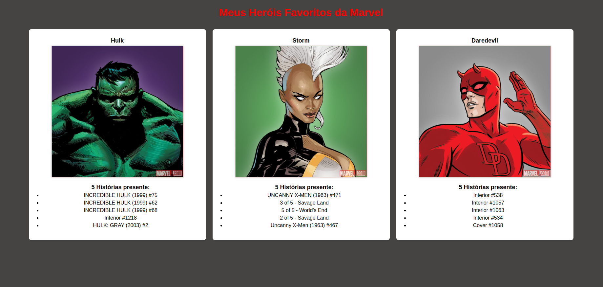
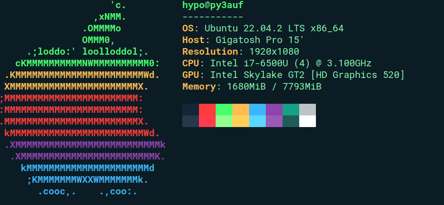

# DesafioAnalista-II
<h1>API de consulta a API da Marvel.</h1>

Eescolhendo 3 heróis, extraia suas imagens e 5 histórias aleatórias atreladas ao seus dados da api.

</>A Api da Marvel devolve suas requests em json.

<h2>Setup do desenvolvimento:</h2>

(É um note dell antigo que tem estética de 1 macbook dos antigos,vulgo Gigatosh)

<h2>Porque XAMPP (Cross-platform, Apache, MySQL, PHP, Perl)?</h2>

O XAMPP é uma solução multiplataforma, o que significa que pode ser executado em sistemas operacionais como Windows, macOS e Linux.

Além do Apache, MySQL (ou MariaDB), PHP e Perl, o XAMPP também inclui outras ferramentas como FileZilla FTP Server e Mercury Mail Server, o que torna uma opção mais abrangente para desenvolvedores que precisam de várias ferramentas adicionais.

<h2>Instalando XAMPP:</h2>

Acesse: <a href="www.apachefriends.org">www.apachefriends.org</a>

Baixe a versão para plataforma desejada.

Neste projeto utilizamos: XAMPP 8.2.4 Para linux.

PHP 8.2.4, 8.1.17 e 8.0.28 
Apache 2.4.56 
MariaDB 5.4.28 
phpMyAdmin 5.2.1 
OpenSSL 1.1.1t

No ambiente linux é necessário tornar executável o arquivo baixado, abrindo o terminal, navegando até a pasta onde foi baixado o arquivo de instalação .run e utlizando o comando sudo chmod +x nome-do-arquivo-baixo 
Digite em seguida sua senha do linux, e execute o .run com 
sudo ./nome-do-arquivo-baixado

Na instalação é só avançar até o final com as configurações recomendadas.

Finalizada a instalação, vamos criar um executável para o XAMPP

(Caso vá copiar os comandos, cuidado ao colar no terminal para que não falte nada ou envie o comando com algum espaço a mais, isso junto ao comando sudo pode acabar criando algum diretório ou arquivo novo com nome*quase igual*)

na home ~ vamos até cd .local/share/applications

criando o XAMPP com touch xampp.desktop

agora editando, vim xampp.desktop

Inserimos:

<pre>
[Desktop Entry]
 Encoding=UTF-8
 Name=XAMPP Control Panel
 Comment=Start and Stop XAMPP
//pode adicionar sudo no início desse comando caso prefira:
 Exec=/opt/lampp/manager-linux-x64.run 
 Icon=/opt/lampp/htdocs/favicon.ico
 Categories=Application
 Type=Application
 Terminal=true
</pre>

Agora têmos um atalho no menu do Ubuntu!

Ainda em .local/share/applications, para que consigamos utilizar o PHP instalado junto ao XAMPP, precisamos ajustar criando um link simbólico nos os binários do nosso OS(onde ficam os executáveis), com o seguinte comando:

sudo ln -s /opt/lampp/bin/php /usr/bin/php

<h3>Ajustando diretório do Apache:</h3>

No terminal:

sudo vim /opt/lampp/apache2/conf/httpd.conf

Vamos alterar a linha 4, substituindo a string do diretório:

<pre>
“/home/seu-user/resto-do-caminho-até-seu-diretório”
</pre>

<h3>Ajustando user de execução:</h3>

sudo vim /opt/lampp/etc/httpd.conf

Linhas 173 e 174, vamos trocar daemon para nosso user.

E nas linhas 229 e 230 vamos alterar document root e Directory para o diretório em que decidimos trabalhar, o mesmo ajustado no apache.

Pronto, agora é inserir seus arquivos dentro da pasta recém configurada e botar pra rodar!

Caso queira testar este projeto, basta abrir um terminal dentro do diretório configurado, e utilizar o comando git clone deste repo.

Lembrando que isso criará uma subpasta dentro do seu ambiente apache, que trata a pasta inserida anteriormente nos arquivos de programação como a raiz do servidor, então para acessar deverá no seu navegador, depois de clonado o repo e inicializado seu XAMPP, acessar localhost/DesafioAnalista-II.

Ou acessar a pasta do DesafioAnalista-II, e pelo terminal,e subir todo conteúdo 1 diretório, a fim de tornar acessível a aplicação na raiz do localhost.

Exemplo:

<pre>
user@nomePC:~/caminhoConfigurado/DesafioAnalista-II$
</pre>

Comando para subir 1 diretório todo conteúdo da pasta atual:

<pre>
sudo mv * ..
</pre>

<h2>Entendendo a API da Marvel:</h2>

Primeiramente deve criar sua conta e solicitar suas api keys.

Com elas em mãos, devemos consultar a seguinte orientação:

<h3>Autenticação para Aplicações no Lado do Servidor</h3>

“Aplicações no lado do servidor devem enviar dois parâmetros além do parâmetro "apikey":

ts - um carimbo de data/hora (ou outra sequência longa que possa ser alterada a cada solicitação)

hash - um resumo md5 do parâmetro "ts", sua chave privada e sua chave pública (por exemplo, md5(ts+chavePrivada+chavePública))

Por exemplo, um usuário com uma chave pública "1234" e uma chave privada "abcd" poderia construir uma chamada válida da seguinte forma: http://gateway.marvel.com/v1/public/comics?ts=1&apikey=1234&hash=ffd275c5130566a2916217b101f26150 (o valor do hash é o resumo md5 de 1abcd1234)”

<h3>Com sua chave em mãos, e  sua timeStamp, podes montar sua chave em formato md5.</h3>

Apartir daí é desenvolver da forma que preferir, sua aplicação.

No caso desse desafio utilizamos os métodos :

GET - /v1/public/characters

GET - /V1/public/characters/{characterId}/stories

Estes métodos foram implementados em php utilizando a bibliteca cURL (Client URL Library).

Outros métodos disponíveis em: <a href="https://developer.marvel.com/docs">https://developer.marvel.com/docs</a>

<h3>Por último, caso você vá clonar este repo, seria bom gerar suas próprias keys e substituir pelas minhas. 
 As chaves possuem limite de uso diário.</h3>
